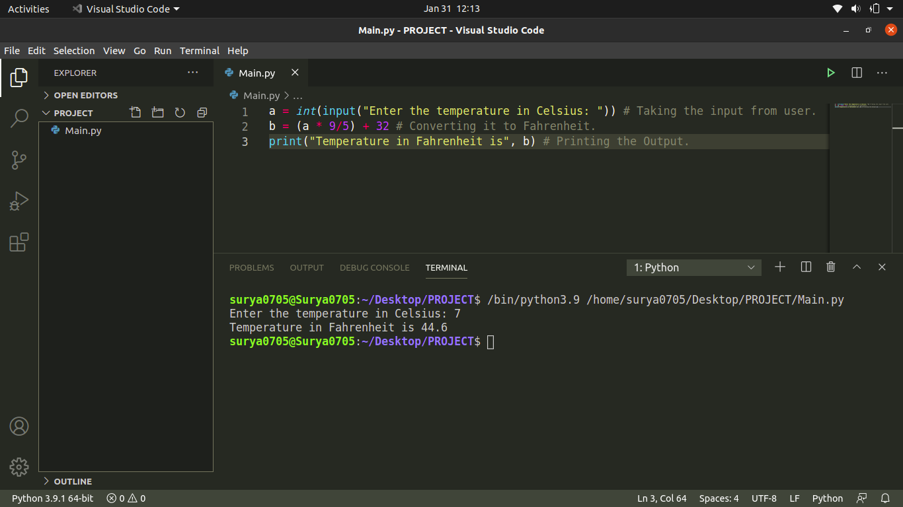

# Celsius_to_Fahrenheit
This Program converts the Celsius temperature to the Fahrenheit temperature. It is a very basic and simple Program and uses a basic Mathematics Equation to do so. Below is a Screenshot of my Program:

Hope that you liked it.
